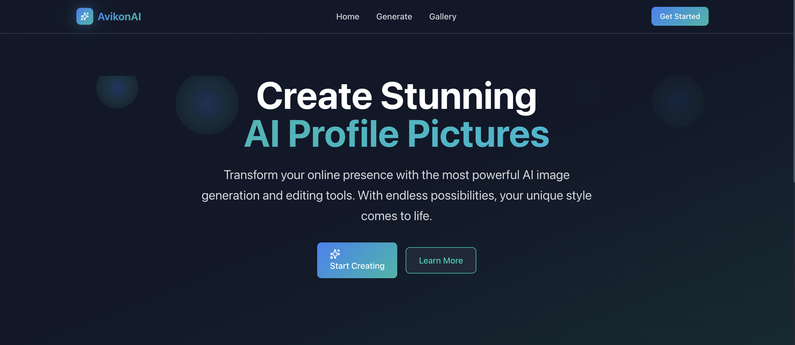
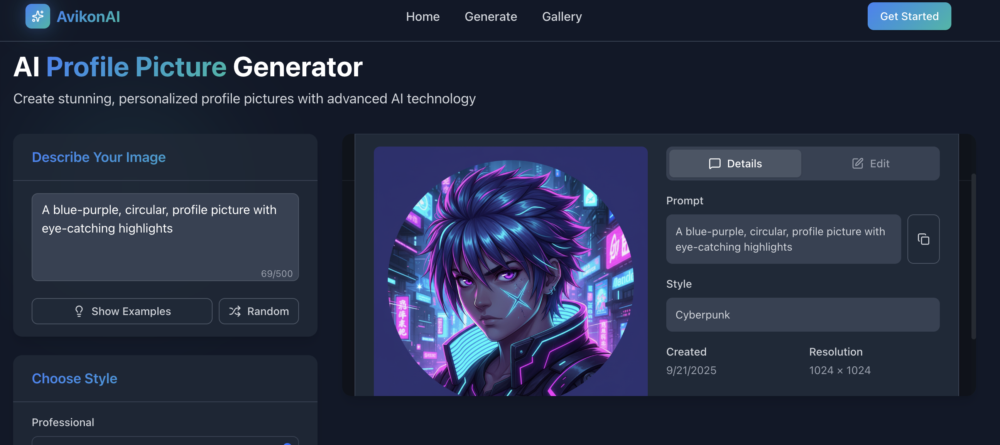

# AvikonAI - AI Profile Picture Generator



AvikonAI is a powerful web application that creates and edits profile pictures using AI technology. Built with Next.js and powered by Google's Gemini AI and Pixo, it offers a seamless experience for generating high-quality profile pictures with various styles and customization options.

## Features

- **Pixo Editing**: Use Pixo's vast array of features for editing avatars after image generation
- **Multiple Styles**: Choose from professional, artistic, gaming, and creative styles
- **High Resolution**: Download crisp, high-resolution images perfect for any platform
- **Privacy First**: Images are processed privately and stored locally
- **Image Upload**: Use reference images as inspiration for generation
- **Gallery Management**: Browse and manage generated images with search and filter capabilities
- **Responsive Design**: Responsive interface with clean dark theme

## Tech Stack

- **Frontend**: Next.js 15.5.3, React 19.1.0, TypeScript
- **Styling**: Tailwind CSS 4, Framer Motion animations
- **UI Components**: Custom components with Headless UI, Lucide React icons
- **AI Integration**: Google Gemini 2.5 Flash Image Model
- **Image Editing**: Pixo Editor integration for editing
- **Image Processing**: Local storage with automatic saving
- **Development**: ESLint, PostCSS, Turbopack

## User Workflow

### 1. **Home Page**
- Landing page with feature overview and call-to-action
- Navigation to generation and gallery pages

### 2. **Image Generation**



- **Describe**: Enter a detailed description of desired profile picture
- **Style Selection**: Choose from multiple preset styles (Professional, Artistic, Gaming, Creative)
- **Reference Image**: Optionally upload a reference image for inspiration
- **Generate**: Click to create AI-generated profile picture using Gemini AI
- **Real-time Progress**: Monitor generation progress with visual feedback

### 3. **Image Editing**


- **Advanced Editor**: Access powerful Pixo Editor integration for detailed image editing
- **Professional Tools**: Crop, resize, adjust colors, apply filters, and add effects
- **Layer Management**: Work with multiple layers for complex edits
- **Non-destructive Editing**: Make changes without losing original image quality
- **Export Options**: Save in multiple formats and resolutions
- **Preview & Download**: View completed image, save it to your gallery, and download high-resolution version

### 4. **Gallery Management**
- **Browse**: View all generated images in grid or list format
- **Search**: Find images by prompt or description
- **Filter**: Sort by style or generation date
- **Re-edit**: Open any image in the editor for further modifications
- **Download**: Re-download any previously generated image

## Project Structure

```
src/
├── app/                    # Next.js app router
│   ├── api/               # API routes
│   │   └── generate-image/ # Image generation endpoint
│   ├── gallery/           # Gallery page
│   ├── generate/          # Generation page
│   ├── layout.tsx         # Root layout
│   └── page.tsx           # Home page
├── components/            # React components
│   ├── features/          # Feature-specific components
│   ├── layout/            # Layout components
│   └── ui/                # Reusable UI components
├── hooks/                 # Custom React hooks
├── lib/                   # Utility libraries
│   ├── api.ts            # API client functions
│   ├── gemini.ts         # Gemini AI integration
│   └── storage/          # Local storage utilities
└── types/                # TypeScript type definitions
```

## Privacy & Security

- Images are processed client-side when possible
- No permanent storage of user images on servers
- Local browser storage for gallery persistence

## License

This project is licensed under the Apache 2.0 License - see the [LICENSE](LICENSE) file for details.


---

**AvikonAI** - Transform your online presence with AI-powered profile pictures.
